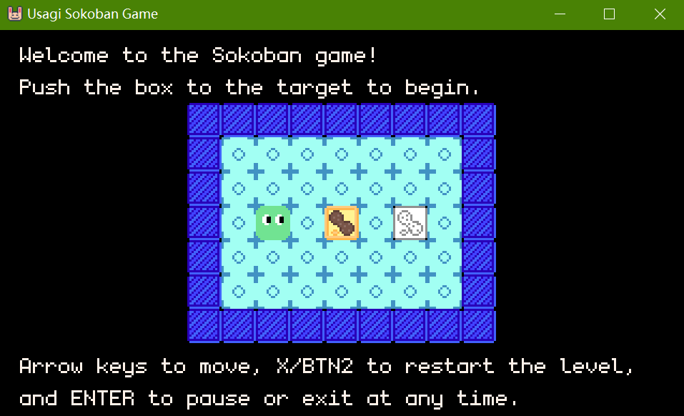

# Usagi Sokoban Game

A classic Sokoban puzzle game ported from VB.NET to Lua using the Usagi Engine.



## About

This project is a Usagi Engine port of the original VB.NET Sokoban game, using Lua as the primary programming language. The gameplay remains faithful to the original version, with all 16 levels including the screen wrapping mechanic introduced at Floor 6.

The game is based on the VB.NET version developed by the same author as this project, available at: https://github.com/Pac-Dessert1436/VBPGE-Sokoban-Game

## Features

- **16 Challenging Levels**: Includes an introductory level and 15 main floors
- **Screen Wrapping**: Unique mechanic unlocked at Floor 6 where players and boxes can teleport across screen edges
- **Built-in Audio**: Dynamic music and sound effects using Usagi Engine's built-in audio system
- **Move Counter**: Track your moves per level and total moves across all levels
- **Level Reset**: Quickly restart any level with the press of a button
- **Victory Screen**: Celebrate completing all levels with a special victory theme

## Controls

| Action | Keyboard | Gamepad |
|--------|----------|---------|
| Move Up | ↑ / W | D-pad Up / Left Stick Up |
| Move Down | ↓ / S | D-pad Down / Left Stick Down |
| Move Left | ← / A | D-pad Left / Left Stick Left |
| Move Right | → / D | D-pad Right / Left Stick Right |
| Reset Level | X | BTN2 |
| Pause / Menu | Enter | Start Button |

## How to Play

1. **Objective**: Push all boxes onto their target positions
2. **Rules**:
   - You can only push boxes, not pull them
   - You cannot push more than one box at a time
   - Boxes cannot be pushed into walls or other boxes
3. **Screen Wrapping (Floor 6+)**: Moving off one edge of the screen teleports you to the opposite edge

## Installation & Running

### Requirements

- Usagi Engine (v1.0.0 or later, see [USAGI.md](USAGI.md) for installation instructions)

### Cloning the Repository

```bash
git clone https://github.com/Pac-Dessert1436/usagi-sokoban-game.git

# Navigate to the project directory
cd usagi-sokoban-game
```

### Running the Game

```bash
# Development mode (hot reload)
usagi dev

# Production mode
usagi run
```

## Project Structure

```
usagi-sokoban-game/
├── main.lua          # Game entry point
├── scenes/
│   ├── game.lua      # Main game logic
│   └── map_data.lua  # Level definitions
├── music/            # Background music tracks
│   ├── game_start.mp3
│   ├── level_cleared.mp3
│   ├── main_theme.mp3
│   └── victory.mp3
├── sfx/              # Sound effects
│   └── box_pushed.wav
├── sprites.png       # Sprite sheet (16x16 tiles)
├── SKILL.md          # Original VB.NET reference and design docs
├── USAGI.md          # Usagi Engine documentation
└── README.md         # This file
```

## Sprite Sheet Layout

The `sprites.png` file contains all game assets in a 16x16 grid:

| Index | Sprite |
|-------|--------|
| 1 | Box on Target |
| 2 | Regular Box |
| 3 | Target Marker |
| 4 | Wall/Obstacle |
| 5 | Walkable Floor |
| 6 | Player (Left) |
| 7 | Player (Right) |
| 8 | Player (Up) |
| 9 | Player (Down) |

## Level Structure

- **Opening**: Tutorial level introducing basic mechanics
- **Floors 1-5**: Standard Sokoban puzzles
- **Floors 6-15**: Puzzles utilizing screen wrapping mechanic

## Differences from VB.NET Version

- Ported to **Lua** using **Usagi Engine**
- Sprite size changed from 20x20 to 16x16 pixels
- Built-in Usagi audio system replaces custom NAudio implementation
- Lua object-oriented design pattern
- Hot reload support during development

## License

This project is licensed under the MIT License. Feel free to use and modify as you see fit.

## Credits

- Original VB.NET implementation by Pac-Dessert1436
- Usagi Engine by [Brett Chalupa](https://brettmakesgames.com)